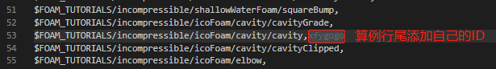

# ofTutorialGallary

## 项目介绍

整理OpenFOAM-8 Tutorials中的所有算例，方便学习交流。 

有关项目的详细介绍请移步wiki：[点击跳转](https://gitee.com/xfygogo/of-tutorial-gallary.wiki.git)

## 工作内容

### 目录结构说明

1级目录参考OpenFOAM tutorials，即根据不同的求解器类型分类，如可压compressible、不可压incompressible、多相流multiphase等。为了能直观看到某个分类下的所有算例，将原有的2级以上的目录都合并在一起，如`$FOAM_TUTORIALS/incompressible/icoFoam/cavity/cavity`算例在本项目中位于`incompressible`目录下的`icoFoam_cavity_cavity`目录中。

所有算例文件夹都已生成，其中包含`case.md`文件用于填写项目说明，`source`文件夹用于存放图片或者动画（有关动画的制作，参考wiki页面：[点击跳转](https://gitee.com/xfygogo/of-tutorial-gallary/wikis/%E5%90%8E%E5%A4%84%E7%90%86-%E5%8A%A8%E7%94%BB%E5%88%B6%E4%BD%9C?sort_id=3562815)），最终目录结构如下。

```sh
# 目录结构
...
compressible/
incompressible/
	...
	icoFoam_cavity_cavity/
		source/
		README.md
	...
...
```

### 算例领取

在每类算例中都给定了一个算例列表文件，如incompressible算例目录中的`incompressible.csv`，也可查看[在线表格](https://kdocs.cn/l/sjeuvIffuK4Y)了解总的项目进度。

领取与工作流程提

- 如何领取算例？通过修改算例分类目录中的`xxx.csv`文件领取算例，推荐使用[轻量级PR](https://gitee.com/help/articles/4291)功能。

  

- 领取算例之后如何工作呢？推荐使用[Fork+PullRequest模式](https://gitee.com/help/articles/4128)。即：
  1. Fork本仓库
  2. 新建分支完成算例说明
  3. 提交代码
  4. 新建Pull Request
  5. 管理员审核，合并到主分支

## 参考算例

- [incompressible/icoFoam_cavity_cavity](incompressible/icoFoam_cavity_cavity)