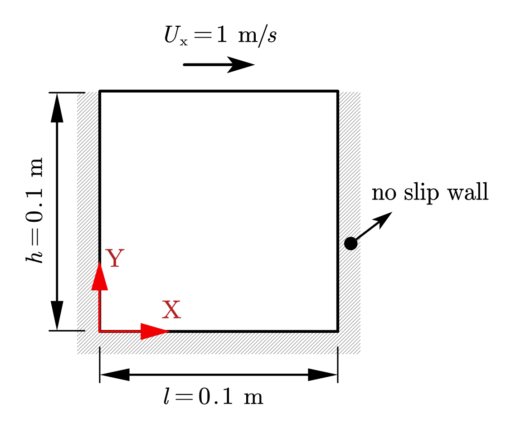
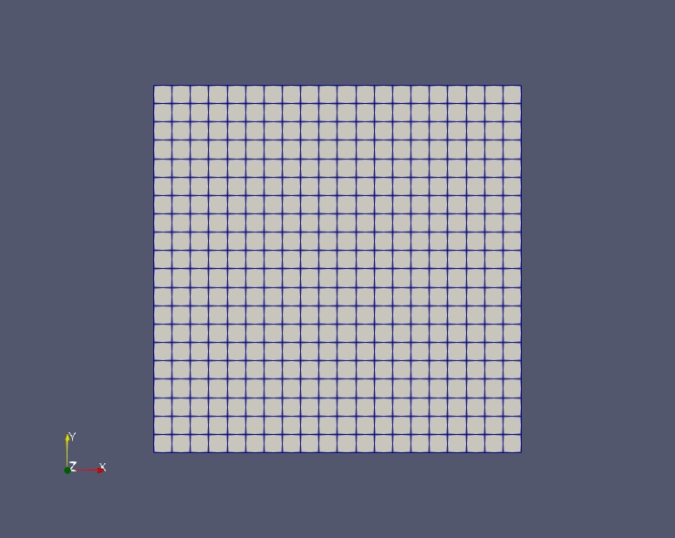
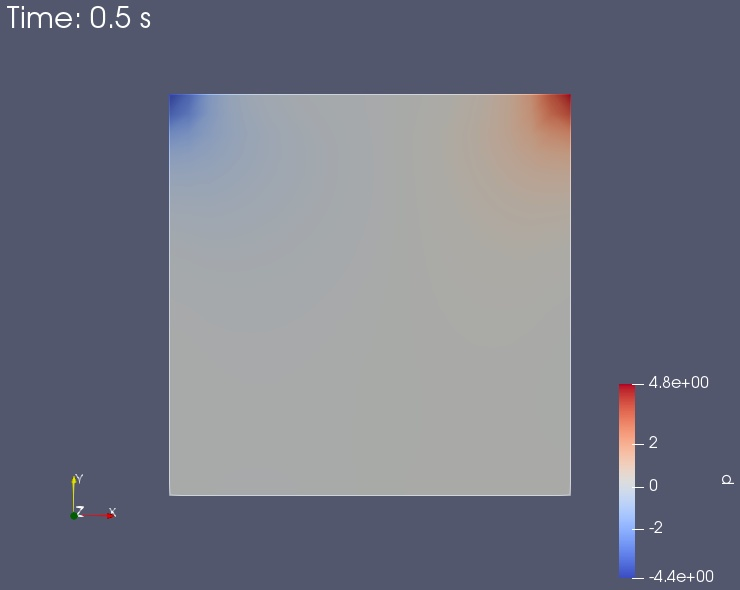
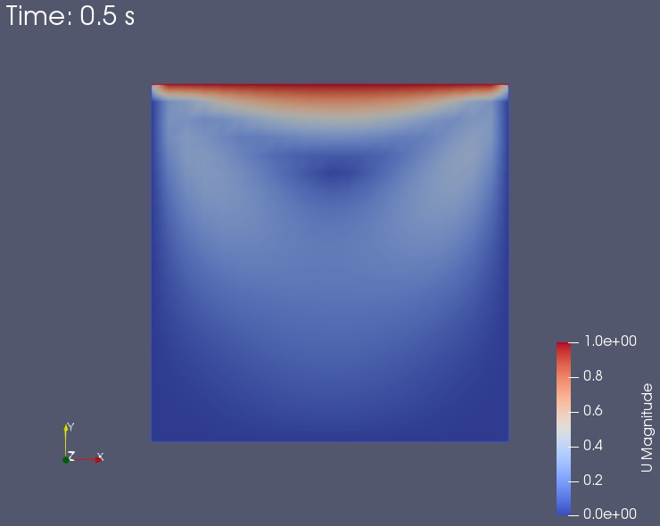
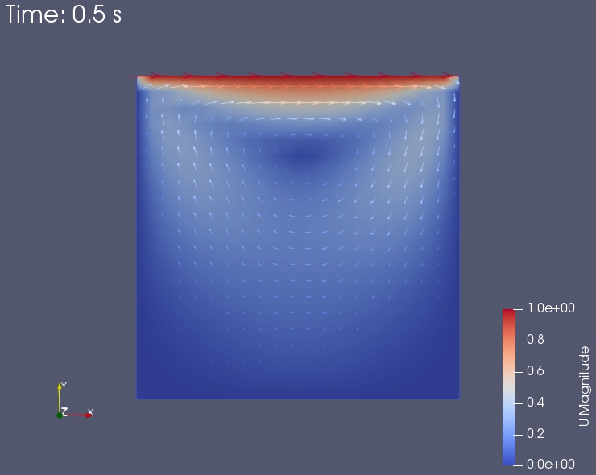
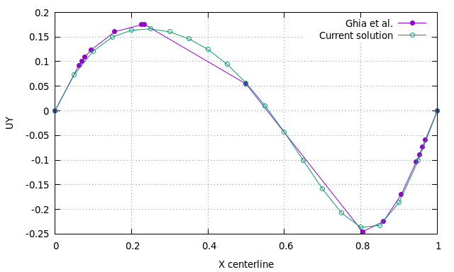
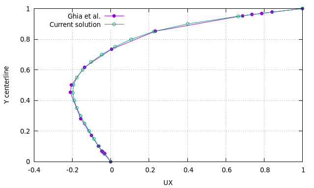

# 算例介绍

上边界以 1m/s 的速度剪切方腔内的流体，其他三个边界为固定的壁面。此算例为二维算例， Z 方向上为单层网格（Z 方向前后面都设置为 empty）。  

# 物理模型简图

说明：能直观看出初始条件、边界条件、几何尺寸等，推荐工具：AxGlyph、ppt、latex下的tikz等。如果可以，请将绘图的源文件存放于算例的source目录中。




# 网格



# 结果

说明：对于瞬态算例，请将动画文件存于source文件夹中，如不熟悉动画制作，可参考项目wiki说明[点击跳转](https://gitee.com/xfygogo/of-tutorial-gallary/wikis/%E5%90%8E%E5%A4%84%E7%90%86-%E5%8A%A8%E7%94%BB%E5%88%B6%E4%BD%9C?sort_id=3562815)。建议保存ParaView的State文件至算例source目录中：File->Save State。









# 计算流程e

说明：类似Allrun脚本的内容，可包括拷贝算例、网格生成、网格划分、（并行）求解、后处理等。

```sh
# 拷贝算例
cp $FOAM_TUTORIALS/incompressible/icoFoam/cavity/cavity -r cavity
cd cavity
# 生成网格；运行求解器
blockMesh
icoFoam
## 或icoFoam 2>&1 | tee log.icoFoam
# 可视化
paraFoam
## 或touch 1.foam && paraview --data=1.foam
```

# 计算耗时

算例运行脚本run：

```sh
blockMesh
icoFoam
```

时间测试：

```sh
$ time bash run
# 结果 
bash run  0.14s user 0.14s system 53% cpu 0.525 total
```

算例运行平台：Inter(R) Core(TM) i5-9500 CPU@3.00GHz

进程数：1

耗时： 0.14 s

# 扩展内容

说明：以下为可选内容。

## 相关算例

- incompressible/icoFoam_cavity_cavityGrade
- incompressible/icoFoam_cavity_cavityClipped
- incompressible/pisoFoam_RAS_cavity
- incompressible/pisoFoam_RAS_cavityCoupledU
- heatTransfer/buoyantSimpleFoam_externalCoupledCavity
- heatTransfer/buoyantSimpleFoam_buoyantCavity

## 文献对比

提取流动稳定后X轴和Y轴中心线上的速度，与文献(Ghia et al., 1982)中的结果比较。


**操作**：

- 几处修改：将`system/blockMeshDict`中的`convertToMeters`设为1.0；`system/controlDict`中的`deltaT`设置为0.01，`endTime`设置为50。

- 重新运行算例，然后运行后处理脚本`run_sampling.sh`。

```sh
#!/bin/bash
postProcess -func sampleDict -latestTime
gnuplot gnuplot/gnuplot_script 
```

**结果**：






## 参考资料

- 文献比较部分参考[Wolf dynamics的OpenFOAM Introductory Course Training Material](http://www.wolfdynamics.com/tutorials.html?layout=edit&id=163)
- Ghia, U., Ghia, K.N., Shin, C.T., 1982. High-Re solutions for incompressible flow using the Navier-Stokes equations and a multigrid method. Journal of Computational Physics 48, 387–411. https://doi.org/10.1016/0021-9991(82)90058-4