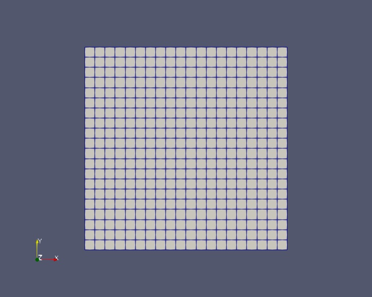

.. _icoFoam:cavity:

===========
cavity
===========

算例介绍
=============

上边界以 1m/s 的速度剪切方腔内的流体，其他三个边界为固定的壁面。此算例为二维算例， Z 方向上为单层网格（Z 方向前后面都设置为 :code:`empty`）。  

物理模型简图
================

说明：能直观看出初始条件、边界条件、几何尺寸等，推荐工具：AxGlyph、ppt、latex下的tikz等。如果可以，请将绘图的源文件存放于算例的source目录中。

.. figure:: cavity/results/icoFoam_cavity_cavity-model.*
    :align: center
    :width: 50 %
    :name: fig:icoFoam_cavity_cavity-model

    物理模型简图

网格
=========

    网格

结果
==========

说明：对于瞬态算例，请将动画文件存于source文件夹中，如不熟悉动画制作，可参考项目 
`wiki说明 <https://gitee.com/xfygogo/of-tutorial-gallary/wikis/%E5%90%8E%E5%A4%84%E7%90%86-%E5%8A%A8%E7%94%BB%E5%88%B6%E4%BD%9C?sort_id=3562815>`_ 。
建议保存ParaView的State文件至算例source目录中：File->Save State。

.. tab:: 压力场

    .. figure:: cavity/results/p_slice.jpeg
        :align: center
        :width: 50 %
        :name: fig:p_slice.jpeg

        压力场

.. tab:: 速度场

    .. figure:: cavity/results/U_slice.jpeg
        :align: center
        :width: 50 %
        :name: fig:p_slU_sliceice.jpeg

        速度场

.. tab:: 速度矢量场

    .. figure:: cavity/results/U_glyph.jpeg
        :align: center
        :width: 50 %
        :name: fig:U_glyph.jpeg

        速度矢量场

计算流程
=============

说明：类似Allrun脚本的内容，可包括拷贝算例、网格生成、网格划分、（并行）求解、后处理等。

.. code-block::  bash
    :linenos:
    :emphasize-lines: 0
    :caption: 计算流程脚本

    # 拷贝算例
    cp $FOAM_TUTORIALS/incompressible/icoFoam/cavity/cavity -r cavity
    cd cavity
    # 生成网格；运行求解器
    blockMesh
    icoFoam
    ## 或icoFoam 2>&1 | tee log.icoFoam
    # 可视化
    paraFoam
    ## 或touch 1.foam && paraview --data=1.foam
    ## 

计算耗时
==============

算例运行脚本run：

.. code-block::  bash
    :linenos:

    blockMesh
    icoFoam

时间测试：

.. code-block::  console
    :linenos:
    :emphasize-lines: 0

    $ time bash run
    bash run  0.14s user 0.14s system 53% cpu 0.525 total

- 算例运行平台：Inter(R) Core(TM) i5-9500 CPU@3.00GHz

- 进程数：1

- 耗时： 0.14 s

扩展内容
===========

.. note::

    说明：以下为可选内容。

相关算例
-----------------

- incompressible/icoFoam_cavity_cavityGrade
- incompressible/icoFoam_cavity_cavityClipped
- incompressible/pisoFoam_RAS_cavity
- incompressible/pisoFoam_RAS_cavityCoupledU
- heatTransfer/buoyantSimpleFoam_externalCoupledCavity
- heatTransfer/buoyantSimpleFoam_buoyantCavity

文献对比
--------------

提取流动稳定后X轴和Y轴中心线上的速度，与文献 :cite:`ghia1982high` 中的结果比较。

.. figure:: cavity/results/U_compare.*
    :align: center
    :width: 50 %
    :name: fig:U_compare

    速度对比

**操作**：

- 几处修改：将 :code:`system/blockMeshDict` 中的 :code:`convertToMeters` 设为1.0；:code:`system/controlDict` 中的 :code:`deltaT` 设置为0.01， :code:`endTime` 设置为50。

- 重新运行算例，然后运行后处理脚本:code:`run_sampling.sh`。

.. code-block::  bash

    #!/bin/bash
    postProcess -func sampleDict -latestTime
    gnuplot gnuplot/gnuplot_script 

**结果**：

.. tab:: X centerline

    .. figure:: cavity/results/X_center.*
        :align: center
        :width: 50 %
        :name: fig:X_center

        对比结果，剖面位置见 :numref:`fig:U_compare`

.. tab:: Y centerline

    .. figure:: cavity/results/Y_center.*
        :align: center
        :width: 50 %
        :name: fig:Y_center

        对比结果，剖面位置见 :numref:`fig:U_compare`

参考资料
-----------------

- 文献比较部分参考 `Wolf dynamics的OpenFOAM Introductory Course Training Material <http://www.wolfdynamics.com/tutorials.html?layout=edit&id=163>`_ 
